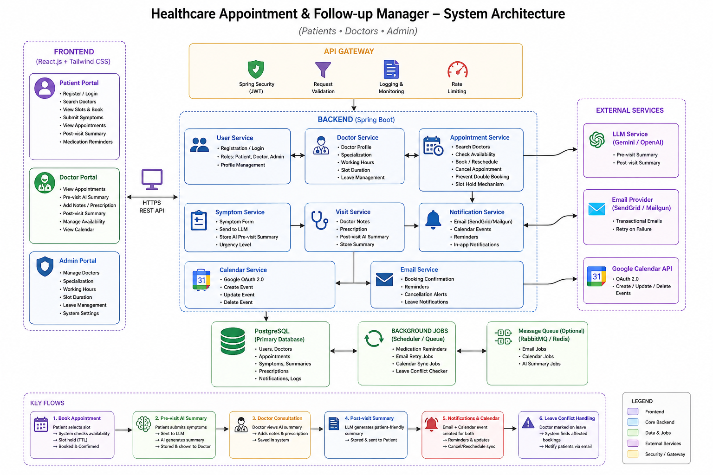

Healthcare Appointment Manager — System Design

This document describes the key architectural decisions, concurrency controls, and failure-handling strategies implemented in the Healthcare Appointment Management System.

The system is designed around three primary goals:

* Prevent appointment conflicts and double-booking
* Maintain data consistency under concurrent requests
* Isolate the core appointment workflow from failures in external services

⸻

1. Double-Booking Prevention

Double-booking can occur when two patients attempt to book the same doctor and appointment slot at approximately the same time.

The system uses multiple layers of protection to maintain appointment integrity.

1.1 Application-Level Validation

The appointment booking operation is executed inside a Spring @Transactional boundary.

Before creating an appointment, the backend checks whether the requested doctor and time slot are already booked:

boolean isConflict =
    appointmentRepository.existsByDoctorIdAndAppointmentTime(
        dto.getDoctorId(),
        dto.getAppointmentTime()
    );
if (isConflict) {
    throw new RuntimeException("Appointment slot is already booked.");
}

If a conflicting appointment exists, the request is rejected and the transaction is rolled back.

This provides the first layer of protection and handles the majority of booking conflicts.

1.2 Database-Level Concurrency Control

An application-level existence check alone is not sufficient for concurrent requests.

For example:

Patient A                         Patient B
   │                                 │
   │ Check slot                      │ Check slot
   │ → Available                     │ → Available
   │                                 │
   │ Create appointment              │ Create appointment
   │                                 │
   └──────────── Same Slot ──────────┘

Both requests could potentially pass the existence check before either transaction commits.

To address concurrent updates, the Appointment entity uses JPA optimistic locking:

@Version
private Long version;

Hibernate uses the version field to detect conflicting updates.

If concurrent operations result in a stale entity version, Hibernate can throw an ObjectOptimisticLockingFailureException.

This approach provides concurrency protection without requiring pessimistic table-level locks for normal appointment operations.

Important: In a production implementation, a database-level unique constraint on (doctor_id, appointment_time) should also be added. Optimistic locking on an Appointment row alone does not, by itself, guarantee that two brand-new appointment rows with identical doctor/time values cannot both be inserted.

A robust production design therefore uses:

Application validation
        +
Database uniqueness constraint
        +
Transactional booking

⸻

2. Doctor Leave Conflict Handling

Doctors may become unavailable due to vacations, emergencies, or other scheduling constraints.

The system handles this using a dedicated leave model rather than modifying appointment slots directly.

2.1 Dedicated Leave Entity

Doctor availability is represented using a DoctorLeave entity.

Conceptually:

DoctorLeave
├── doctorId
└── leaveDate

When an administrator adds a leave date, the corresponding record is persisted.

This keeps doctor availability separate from appointment data and avoids deleting or modifying existing appointment records merely because a doctor becomes unavailable.

⸻

2.2 Pre-Booking Validation

Before creating an appointment, the booking service checks whether the doctor is on leave:

if (doctorLeaveRepository.existsByDoctorIdAndLeaveDate(
        dto.getDoctorId(),
        requestedDate)) {
    throw new RuntimeException(
        "The doctor is on leave on this date."
    );
}

The validation occurs before the booking transaction proceeds.

The booking flow therefore becomes:

Booking Request
      │
      ▼
Check Doctor Leave
      │
      ├── On Leave ──────► Reject Request
      │
      ▼
Check Appointment Conflict
      │
      ├── Conflict ──────► Reject Request
      │
      ▼
Create Appointment

⸻

2.3 Leave Added After Existing Bookings

A more complex case occurs when an administrator adds a leave date after appointments have already been booked.

For example:

Doctor has appointments:
09:00 → Patient A
10:00 → Patient B
11:00 → Patient C
Admin adds doctor leave for the same date.

A production implementation can trigger an asynchronous cancellation workflow:

Doctor Leave Created
        │
        ▼
Find Existing Appointments
        │
        ▼
Cancel Affected Appointments
        │
        ▼
Notify Patients
        │
        ▼
Patients Reschedule

This keeps the leave record authoritative while allowing affected patients to be informed and reschedule their appointments.

⸻

3. Slot Hold Mechanism

The current implementation relies on transactional booking and concurrency control.

For a higher-traffic production environment, a temporary slot-hold mechanism can be introduced using Redis.

3.1 Problem

Consider a patient selecting a 15:00 appointment.

The patient may spend several minutes entering symptoms before submitting the booking.

Without a temporary hold:

Patient A selects 15:00
        │
        │ fills form
        │
        │
Patient B selects 15:00
        │
        ▼
Patient B books the slot

Patient A may then submit an appointment request for a slot that was available when they started the process.

⸻

3.2 Redis-Based Hold

A production implementation can create a temporary Redis key when the patient begins the booking process:

SETEX lock:doctor_1:slot_1500 300 patient_42

The key has a TTL of 300 seconds (5 minutes).

Conceptually:

Patient selects slot
        │
        ▼
Create Redis lock
        │
        │ TTL = 5 minutes
        ▼
Slot temporarily unavailable
        │
        ├───────────────┐
        │               │
   Booking succeeds   User abandons
        │               │
        ▼               ▼
Delete Redis key    TTL expires
        │               │
        └───────┬───────┘
                ▼
          Slot released

Benefits

* Prevents other users from selecting a temporarily held slot
* Automatically releases abandoned slots
* Does not require a cleanup cron job
* Scales better for high-traffic booking systems

The Redis hold should be treated as a temporary reservation, not the final source of truth.

The PostgreSQL transaction remains authoritative for the permanent appointment.

⸻

4. External API Failure Handling

The application communicates with several external services:

Healthcare Backend
      │
      ├── Gemini API
      ├── Google Calendar API
      └── Vercel Email Relay

External services can experience:

* Network failures
* Request timeouts
* Rate limits
* HTTP 5xx errors
* Temporary service outages

The system therefore separates core database operations from non-critical external notifications.

⸻

5. Asynchronous Notifications

Notification operations such as booking confirmation emails are handled asynchronously using Spring’s @Async.

Conceptually:

@Async
public void sendBookingConfirmation(...) {
    // Send notification
}

The main booking flow remains focused on the database transaction:

Booking Request
      │
      ▼
Validate Request
      │
      ▼
Create Appointment
      │
      ▼
Commit PostgreSQL Transaction
      │
      ├──────────────► Background Notification
      │
      ▼
Return Response

This prevents email delivery latency from unnecessarily blocking the appointment booking request.

⸻

6. Graceful Degradation

External notification failures should not invalidate a successfully created appointment.

For example, if the email relay returns:

HTTP 500 Internal Server Error

the asynchronous notification task can catch the failure:

try {
    // Call email relay
} catch (Exception e) {
    System.err.println(
        "Failed to send booking confirmation: "
        + e.getMessage()
    );
}

The failure is isolated from the main booking transaction.

Therefore:

Appointment Database Transaction
             │
             ▼
        Appointment Saved
             │
             ├──────────────► Email succeeds
             │
             └──────────────► Email fails
                                  │
                                  ▼
                              Log Error

In either case, the appointment remains stored in PostgreSQL.

This provides graceful degradation for non-critical external services.

⸻

7. Transaction Boundaries

The appointment booking operation uses a transactional boundary to ensure that related database operations are handled consistently.

Conceptually:

@Transactional
public Appointment bookAppointment(...) {
    // Validate doctor
    // Validate leave
    // Check appointment conflict
    // Create appointment
    // Persist appointment
    return appointment;
}

The transaction protects the core database state.

If a database operation fails during the transaction:

Validation
    │
    ▼
Database Operation
    │
    ├── Success ──────► Commit
    │
    └── Failure ──────► Rollback

External notification operations should remain outside the critical database transaction whenever possible.

⸻

8. Failure Isolation

The architecture separates critical operations from optional integrations.

Component	Failure Impact
PostgreSQL	Appointment operation fails
Appointment transaction	Booking is rolled back
Gemini API	AI summary may fail; core appointment can remain available
Google Calendar API	Calendar synchronization may fail
Email Relay	Notification may fail
Redis	Temporary slot-hold functionality may become unavailable

The core appointment database is treated as the primary source of truth.

External services enhance the system but should not unnecessarily determine whether an appointment can exist.

⸻

9. Consistency Model

The system follows a practical distributed-system approach:

                    PostgreSQL
                  Source of Truth
                        │
          ┌─────────────┼─────────────┐
          │             │             │
          ▼             ▼             ▼
       Gemini       Calendar       Email
          │             │             │
          └─────────────┴─────────────┘
                 External Systems

PostgreSQL maintains the authoritative state for:

* Users
* Doctors
* Patients
* Appointments
* Medications
* Doctor leaves

External systems are treated as integrations whose state can be synchronized independently.

⸻

10. Concurrency Strategy

The appointment booking system uses multiple layers of concurrency protection:

                 Booking Request
                        │
                        ▼
               Transaction Boundary
                        │
                        ▼
              Doctor Leave Validation
                        │
                        ▼
             Application-Level Conflict
                    Validation
                        │
                        ▼
               Database Persistence
                        │
                        ▼
              Concurrency Protection
                        │
                        ▼
                  Appointment

For a production-scale implementation, the recommended protection stack is:

Redis Slot Hold
       +
@Transactional
       +
Application Validation
       +
Database Unique Constraint
       +
Optimistic Locking

Each layer addresses a different failure mode rather than relying on a single mechanism.

⸻

11. Design Principles

The system follows several architectural principles:

Single Source of Truth

PostgreSQL is the authoritative source for appointment and scheduling state.

Fail Independently

Failure of an external service should not unnecessarily fail the core appointment workflow.

Validate Early

Doctor availability, leave status, and appointment conflicts are checked before database persistence.

Prefer Optimistic Concurrency

Optimistic locking avoids unnecessary database locks while still detecting conflicting updates.

Temporary State vs. Permanent State

Redis is suitable for temporary slot holds, while PostgreSQL remains responsible for permanent appointment state.

Asynchronous Non-Critical Operations

Notifications and other non-critical integrations can execute outside the main request path.

⸻

12. Production Improvements

The current architecture provides a solid foundation, but several improvements would be appropriate for production-scale deployment:

1. Add a database-level unique constraint on doctor and appointment time.
2. Replace System.err.println with structured application logging.
3. Add retry policies with exponential backoff for transient external API failures.
4. Introduce a message queue for reliable asynchronous notifications.
5. Add Redis-based slot holds for high-traffic booking scenarios.
6. Implement idempotency keys for appointment booking requests.
7. Add monitoring and alerting for failed Calendar, Gemini, and email operations.
8. Store failed external events for later retry rather than only logging them.
9. Add automated tests specifically for concurrent booking scenarios.
10. Use database migrations such as Flyway or Liquibase instead of relying solely on ddl-auto=update.

⸻

Conclusion

The Healthcare Appointment Management System is designed around transactional consistency, concurrency control, and failure isolation.

The core appointment workflow is backed by PostgreSQL and protected through transactional validation and concurrency mechanisms, while external integrations such as Gemini, Google Calendar, and email are decoupled from the critical database path.

The architecture can subsequently be extended with Redis slot holds, database uniqueness constraints, reliable message queues, retries, idempotency, and observability to support a higher-traffic production environment.